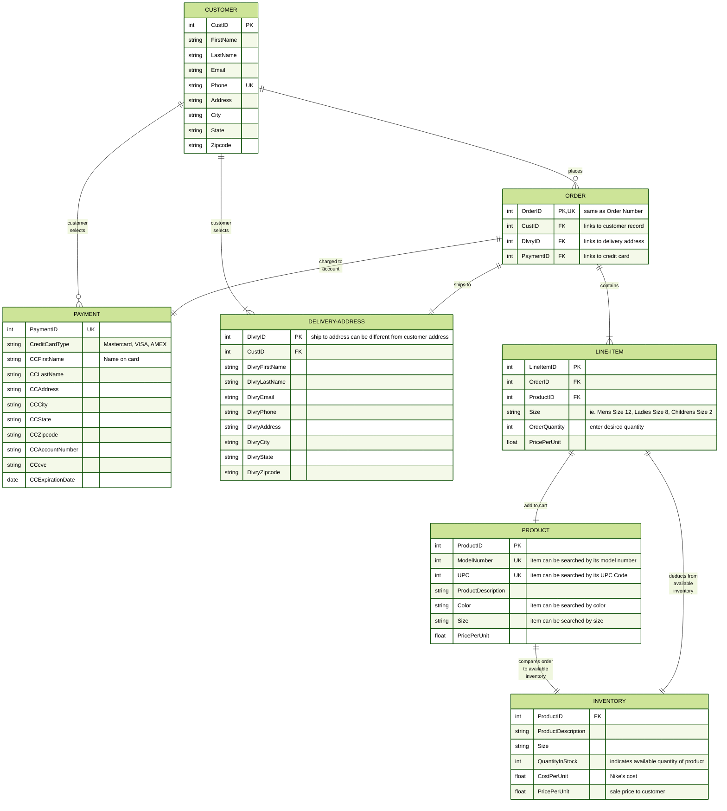

### Kristina Solloway
### NikeStore.ERD.md

# Nike Shoe Store Ordering Process

### Description of Entities (database tables)  
**CUSTOMER**  - This table houses the customer's personal contact information; the originator of the ORDER.  
**DELIVERY-ADDRESS** - CUSTOMER can select from a collection of saved delivery addresses, be it to themselves, or to a third party.  
**PAYMENT** - CUSTOMER can select from a collection of on file credit cards accounts for online shopping.  
**ORDER** - CUSTOMER creates a new ORDER by selecting a PRODUCT to add to the cart.  
**PRODUCT** - CUSTOMER searches the PRODUCT table according to personal specifications (ie. size, color, model number, UPC Code).  
PRODUCT table houses all of the products the store offers, and is added to the LINE-ITEM when the CUSOMTER selcts it.  
**LINE-ITEM** - PRODUCT is added to the LINE-ITEM of the ORDER. Multiple LINE-ITEMS can be selected.  
**INVENTORY** - When the PRODUCT is selected for the LINE-ITEM in the ORDER, it is compared to the INVENTORY table to see if the item is in stock.  If it's in stock, the Quantity will be deducted from the INVENTORY table when the sale is finalized. This maintains the available inventory quantities in real time.

